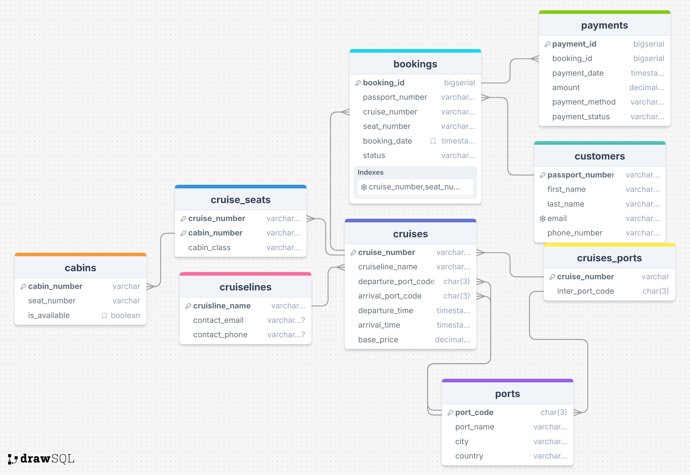

# Course work [2025 HR S4] SQL & Data Processing

## OLTP solution

**OLTP Script path**: `oltp/sql/initial.sql`

**OLTP schema**:

https://drawsql.app/teams/s-321/diagrams/adamovich-course-work-oltp

### OLTP Cruise Booking System Database

The OLTP database stores:

- **Customer data**: Personal and contact information
- **Cruise operations**: Cruise lines, ports, and voyage details (routes, schedules, pricing)
- **Inventory**: Cabins and seating arrangements with availability status
- **Transactions**: Bookings with assigned accommodations and status
- **Payments**: Financial transactions linked to bookings

This database supports real-time transaction processing for the cruise booking business operations.

## OLAP solution
*Design snowflake DWH (2 Facts, 1 SCD Type 2)*

**OLAP schema**:

https://drawsql.app/teams/s-321/diagrams/adamovich-course-work-olap

### OLAP Cruise Analytics Database

The OLAP database supports analytics for:

- **Revenue analysis**: Performance by cruise line, route, and time period
- **Customer insights**: Booking patterns and customer segmentation
- **Cruise metrics**: Occupancy rates, popularity, and seat availability
- **Geographic trends**: Popular ports, routes, and destinations
- **Time-based analysis**: Seasonal patterns across booking and travel dates

The dimensional model enables multi-faceted reporting across time dimensions, geographical hierarchies, and booking characteristics to optimize cruise operations and marketing strategies.

## Cruise Booking System Database Architecture

### OLTP Schema
- **Operational tables**: cruiselines, ports, cruises, cabins, cruise_seats, customers, bookings, payments
- **Key relationships**: cruises link to cruiselines and ports; bookings connect customers to specific cruise seats
- **Primary constraints**: Natural keys for entities with appropriate foreign key relationships
- **Loading process**: Uses staging tables with conflict handling for data integrity

## #OLAP Schema (Star Design)
- **Dimension tables**: Geographic hierarchy (country→city→port), time dimensions (booking/departure/arrival), customers, cruises
- **Fact tables**: fact_booking (transaction details) and fact_cruise (performance metrics)
- **Special structures**: Bridge table for cruise-port relationships; SCD tracking for customer changes
- **ETL mechanism**: Postgres Foreign Data Wrapper connects schemas for dimensional loading

## Instructions of scripts to run

You can start two postgres DB`s by running docker compose files in oltp and olap folders.

### OLTP Schema

First run `initial.sql` to create oltp schema and then `create.sql` file to copy data from `.csv` files into temporary tables and then into normal tables

### OLAP Schema

First run `olap_script.sql` file to create olap schema, then `fdw_setup.sql` file to setup fdw connection(creds there are for db in oltp docker contsiner) and copy tables from a separate oltp database to fdw tables, after run `migrate.sql` file to migrate data from fdw tables to olap tables 

### Queries based on OLTP and OLAP DBs to get insights

You can find out insights for OLTP and OLAP dbs in folders:
- `olap/insights`
- `oltp/insights`

## Power BI Report

The Cruise Operations Dashboard displays:

- View showing cruise line data
- Revenue visualization with a horizontal bar chart
- Bookings by Year scatter plot
- Port performance table showing booking at different ports
- Filter options for cruise lines and ports

The dashboard tracks cruise revenue and booking metrics across different cruise lines and port locations
